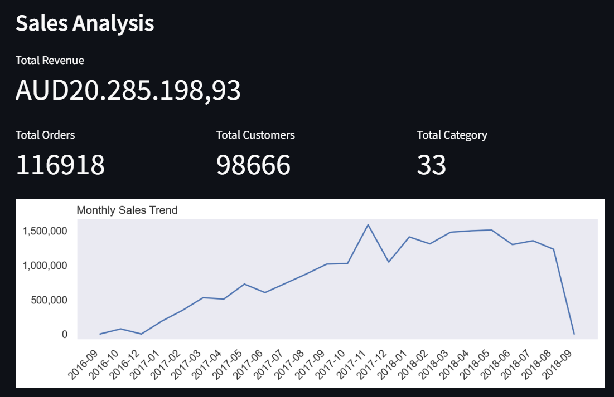
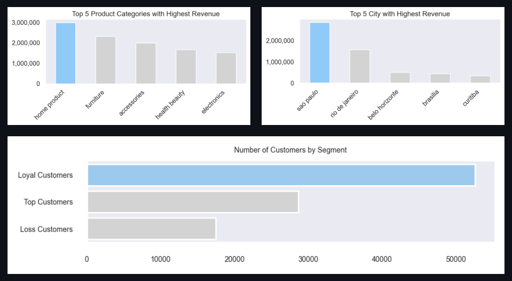

# RFM-Analysis
This project aims to analyze e-commerce sales data from 2016 to 2019 to gain insights into customer behavior by segmenting customers using RFM (Recency, Frequency, Monetary) analysis.

[Data Source](https://www.kaggle.com/datasets/olistbr/brazilian-ecommerce)

### Insight
Sales Performance Overview:
Brazilian ecommers has strong growth from Q4 2016 to Q2 2018, 
with a significant revenue spike during November-December 2017, 
likely driven by increased consumer spending during the holiday season. 
However, the sharp revenue decline toward the end of 2018 requires prompt investigation, 
as it could indicate either incomplete data or a substantial market disruption.

Product Category Analysis:
Home products are the top revenue earners, significantly outpacing other categories. 
Furniture holds a solid second place, highlighting a profitable market in home-related merchandise. 
Electronics, typically a high-revenue category, ranks fifth, which may suggest an opportunity for strategic growth or a need to reassess the product line.

Geographical Revenue Distribution:
São Paulo is the leading source of revenue, which is consistent with its status as Brazil's economic center. 
There is a gap between São Paulo and the next highest contributor, Rio de Janeiro. 
The inclusion of Belo Horizonte and Brasília in the top five further emphasizes the importance of major urban centers to the company's revenue.

Customer Segmentation Insights:
The customer base is well-segmented, with Loyal Customers representing the largest group, indicating strong retention efforts. 
The significant presence of Top Customers suggests a valuable, high-spending demographic. 
Although the Loss Customers segment is smaller, it presents an opportunity for targeted re-engagement strategies.

Strategic Recommendations:
1. Focus on expanding and optimizing the home products and furniture categories to capitalize on their strong market position.
2. Investigate the sales decline in late 2018 to identify and address any underlying issues.
3. Develop strategies to transition Top Customers into Loyal Customers, enhancing their long-term value.
4. Explore strategies for market penetration in cities beyond São Paulo to diversify the revenue base.
5. Targeted campaigns to re-engage the Loss Customers segment and reduce further attrition.
6. Reevaluate the electronics category, considering product line expansion or targeted marketing efforts to boost its performance.
7. Leverage seasonal trends by creating targeted promotional strategies for future peak periods.

